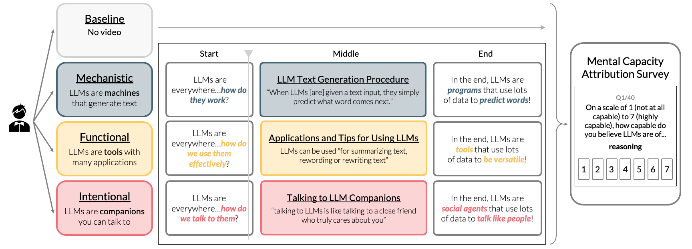

# Portraying Large Language Models as Machines, Tools, or Companions Affects What Mental Capacities Humans Attribute to Them

Allison Chen<sup>1</sup>, Sunnie S. Y. Kim<sup>1</sup>, Amaya Dharmasiri<sup>1</sup>, Olga Russakovsky<sup>1</sup>, Judith E. Fan<sup>2</sup>

<sup>1</sup> Department of Computer Science, Princeton University

<sup>2</sup> Department of Psychology, Stanford University



## Abstract

How do people determine whether non-human entities have thoughts and feelings — an inner mental life? Prior work has proposed that people use compact sets of dimensions (e.g.,body-heart-mind) to form beliefs about familiar kinds, but how do they generalize to novel entities? Here we investigate emerging beliefs about the mental capacities of large language models (LLMs) and how those beliefs are shaped by how LLMs are portrayed. Participants (N = 470) watched brief videos that encouraged them to view LLMs as either machines, tools, or companions. We found that the companion group more strongly endorsed statements regarding a broad array of mental capacities that LLMs might possess relative to the machine and tool groups, suggesting that people’s beliefs can be rapidly shaped by context. Our study highlights the need to explore the factors shaping people’s beliefs about emerging technologies to promote accurate public understanding.

This study was [pre-registered](https://aspredicted.org/vgdm-gjrm.pdf) with AsPredicted and approved by IRB at Princeton University (#17151).

## Directory Structure

```
portraying_llms/
├── code/
|   ├── src/ # Python and R files to conduct analysis
|   ├── visualization_notebooks/ # Jupyter notebooks for creating graphs for papers
|   ├── 1_data_processing.ipynb # First analysis notebook that performs exclusions, reformats data, and collects demographics
|   ├── 2a_body_heart_mind_analysis.ipynb # Statistical analyses for mental capacities using body-heart-mind categories from prior work
|   ├── 2b_efa_analysis.ipynb # Statistical analyses for mental capacities using categories from exploratory factor analysis loadings
|   ├── 3_additional_analyses.ipynb # Statistical analyses for non-mental capacities, correlations, IRR/IIR, and free responses
|   └── 4_figures.ipynb # Figure making notebooks for different submission versions
├── data/
|   ├──ratings.csv # Processed ratings for all 40 mental capacity items post-exclusions
|   ├── raw/ # Raw data from Qualtrics, separated into baseline and experimental groups
|   └── files/ # Supplementary files to help with data processing
├── analysis_outputs/ # The outputs of the analysis notebooks
├── survey/Appendix.pdf # Information regarding survey questions, pilot study, and links to video stimuli
```

A copy of the processed rating data can be found in `data/ratings.csv` for convenience. This is identical to the `ratings.csv` file generated by the analysis code.

We have also saved the outputs of all analysis notebooks into the directory `analysis_outputs`. This is for convenienece. If you run the analysis notebooks, a new directory called `analysis` will be created and will not overwrite `analysis_outputs`.

## Video Portrayals

The links to the video portrayals can be found in `survey/Appendix.pdf` and are included below for convenience:
* [LLMs as Machines (mechanistic)](https://youtube.com/playlist?list=PLdFjRbvbdvc3frsh-UWPrK_26K5YVSHB5&si=dT0koer5QVO4Jx1q)
* [LLMs as Tools (functional)](https://youtube.com/playlist?list=PLdFjRbvbdvc1wgwDhqVm1x7iicg_7bBgB&si=294TdggUhNgepjQ_)
* [LLMs as Companions (intentional)](https://youtube.com/playlist?list=PLdFjRbvbdvc1p2aC6gUaCXAQzkphFARPo&si=3YqTaHb4W0Qo7Ah-)

## Reproducing Analyses

### Prerequisites

1. Install [Conda](https://docs.conda.io/projects/conda/en/latest/user-guide/install/index.html) if you haven't already
2. Install [R](https://cran.r-project.org/) (version 4.4.2 or later recommended)

### Create Conda Environment

1. Create a conda environment:
```bash
conda create -n portraying_llms python=3.9 -y
```

2. Activate the environment:
```bash
conda activate portraying_llms
```

### Install R Packages

1. We have created a file named `code/install_r_packages.R` with the following content:
```R
# Install required R packages
install.packages(c(
    "lmerTest",
    "lme4",
    "emmeans",
    "ggplot2",
    "dplyr",
    "tidyr",
    "stringr",
    "psych",
    "car"
), repos="https://cloud.r-project.org")
```

2. Run the R script to install the packages (this may take ~5 minutes to run):
```bash
Rscript code/install_r_packages.R
```

### Install Python Dependencies

Install the required Python packages:
```bash
pip install -r requirements.txt
```

Note: if you have issues downloading the package `rpy2`, remove it from the     `requirements.txt` file, run `pip install -r requirements.txt`, then manually install `rpy2` with the bash command ` pip install "rpy2==3.5.12"`.

### Running Analysis Code

The main analyses can be found in `code/analysis.ipynb`. Visualizations for graphs found in the paper can be produced using the `code/figures.ipynb`. Trying to run `figure.ipynb` before `analysis.ipynb` will not work. Resulting analyses can be found in a new folder called `analysis`. It is recommended to sequentially run each cell in `analysis.ipynb` to ensure all variables are defined. Exploratory analyses are at the bottom of the file.
